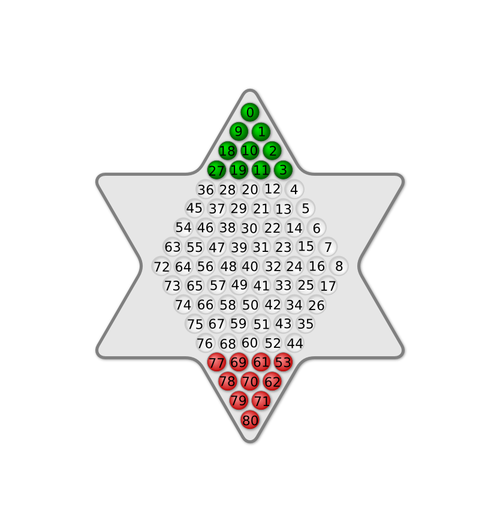

# Code for AI for Traditional Games Spring 2015

There are two programs in this repository:

1. GameMaster - A Java program that controls the interactions between agents and a moderator running the game.

2. ChineseCheckersModerator - A C++ program that validates moves and moderates the play of a game of Chinese Checkers

3. ChineseCheckersRandom - A C++ program that plays a game of Chinese Checkers by taking each move randomly.

Additionally there are various partial agent implementations to play Chinese Checkers.

## GameMaster
GameMaster is a Java programs that controls the interactions between agents and a master running the game.
It has both a command line interface and a graphical user interface.

### GUI (WIP)
If GameMaster is executed with no arguments the GUI interface is loaded.

### Command line interface
To start a game between two random players type the following:

    java GameMaster -1 'path/to/breakthrough_random player1' -2 'path/to/breakthrough_random player2' -m 'path/to/breakthrough'

Alternatively, the game setup can be stored in a response file like

    --player1=path/to/breakthrough_random player1
    --player2=path/to/breakthrough_random player2
    --master=path/to/breakthrough

It can then be loaded like:

    java GameMaster @response_file_name

A sample response file is included named Random.vs.Random.txt.

Running GameMaster with the argument `--help` will display the full set of options that the program supports.

## ChineseCheckersModerator
ChineseCheckersModerator is a C++ program that validates moves and moderates the play of a game of Chinese Checkers.
It is responsible for the following tasks:
* Tracking the players in the game
* Ensuring all played moves are valid
* Ensuring that a move is played within the required time limit
* Ensuring that a player does not play out of turn
* Determining when a game is over

## Communication Protocol
All communication between agents and the moderator will use only `std::cin` and `std::cout` (`stdin` and `stdout` in C and `System.in` and `System.out` in Java).
You may freely write to `std::cerr` if you wish to have debugging output (`stderr` in C and `System.err` in Java).
Anything written to `std::cout` will be considered a command.
Any invalid command will result in forfeiting the game.

There are two types of commands: GameMaster commands and game commands.

### GameMaster commands
GameMaster commands are generic non-game commands related to setting up a game to play. All of these commands can be sent by an agent. Only the `#quit` command will be sent to an agent.

#### `#getname ID`
Returns the name of player with ID.
#### `#moderator`
Registers the agent as a moderator. It will receive all messages and broadcasts must be qualified by their recipient. It is intended for use only by the ChineseCheckersModerator
#### `#name NAME`
Declares the current agent to be named NAME. No spaces are allowed. The names `moderator` and `observer` are reserved.
#### `#players`
Returns the number of connected players.
#### `#quit`
Immediately terminates the game. This message is always broadcast to all clients.

### Game commands
An agent must be able to respond to all of the commands below. Only the `MOVE` command should be sent by an agent.

#### `BEGIN CHINESECHECKERS player1 player2`
Starts a new game with player1 starting first.
The names player1 and player2 will be replaced with the names provided to the moderator with the `#name` command.

#### `FINAL winner BEATS loser`
Declares the game over with the winner and loser specified.
As with `BEGIN`, the names declared by the `#name` command will be used in place of winner and loser.

#### `MOVE from_location TO to_location`
Moves the piece at `from_location` to `to_location`.
An agent will receive this command to indicate an opponents move.
An agent will send this command to indicate their move.
A location is specified as a single integer ranging from 0 to 80, as in the above image.

### `UNDO from_location TO to_location`
Undoes the effects of a `MOVE from_location TO to_location` command.

This command needs to only be supported prior to the first call of the `BEGIN` command.

#### `LISTMOVES`
Directs the agent to list all the valid moves for the current board state. A move will be formatted as `from, to` with a comma between `from` and `to` semi-colons between moves. The order of the moves may vary. For example, the valid moves at the beginning of the game are

    2, 4; 2, 20; 3, 4; 3, 12; 10, 12; 10, 28; 11, 12; 11, 20; 18, 20; 18, 36; 19, 20; 19, 28; 27, 28; 27, 36;

This command needs to only be supported prior to the first call of the `BEGIN` command.

### `NEXTMOVE`
Prints out the next move the agent would play given the current board state.
A move will be formatted as `from, to` with a command between `from` and `to`.
For example, this command may return

    2, 4

This command needs to only be supported prior to the first call of the `BEGIN` command.

#### `DUMPSTATE`
Directs the agent to print out the current game state.
The format is the digit 1 or 2 indicating whose turn it is, followed by a space, followed by 81 integers valued 0, 1, or 2, indicating an empty square, a place occupied by player 1, or a place occupied by player 2. For example, the state prior to the game starting should be:

    1 1 1 1 1 0 0 0 0 0 1 1 1 0 0 0 0 0 0 1 1 0 0 0 0 0 0 0 1 0 0 0 0 0 0 0 0 0 0 0 0 0 0 0 0 0 0 0 0 0 0 0 0 0 2 0 0 0 0 0 0 0 2 2 0 0 0 0 0 0 2 2 2 0 0 0 0 0 2 2 2 2

This corresponds to the board position:

This command needs to only be supported prior to the first call of the `BEGIN` command.

#### `LOADSTATE new_state`
Directs the agent to load new_state as the current state. The format is identical to that of `DUMPSTATE`.

This command needs to only be supported prior to the first call of the `BEGIN` command.

## Your program
When your program starts is must immediately register using the `#name` command.
It will then wait for the `BEGIN` command to start a game.
Prior to a game starting, your agent should correctly respond to `LOADSTATE`, `DUMPSTATE`, `LISTMOVES`, and the `MOVE` command which will immediately call the apply moves.
The purpose of handling these commands prior to a game beginning to allow for automated testing of your agent's handling of the game state.

## Sample Agents
There are two sample agent implementations in the `SampleAgents` directory in C++, and Java.
These provide a very bare framework to show how an agent should be communicating.

Additionally there are two partial Chinese Checkers agents, again in C++ and Java, in the `PartialChineseCheckers` directory. These agents play the game correctly, and speak the above communication protocol, however they do not know how to play jump moves. There are also many design decisions inside the state representation that were made for code clarity instead of efficiency. Improving this will make an agent stronger.

Finally, when compiling the Moderator project, a ChineseCheckersRandom program will be created. This agent will play all of the rules of Chinese Checkers and it speaks the above communication protocol, but its move selection is uniformly random among all of its options. If at least one command line parameter is passed, the first will be used as the agent's name instead of the default "Random".

## Compiling Everything
Since GameMaster is Java, a simple "javac GameMaster.java" in the appropriate directory is enough.

To build the moderator and random agent, the build is operating system dependent.

If you are using Visual Studio 2012 on Windows, load the solution file VS2012\breakthrough.sln and build the two projects contained within. FIXME

If you are using Linux, use CMake. Create a new build directory, then in a terminal execute `cmake path/to/Moderator; make`. Alternatively the provided makefile should also work.

If you are using OSX, the provided makefile should work. Alternatively the CMake build should also work, if you have CMake installed.

If there are any problems compiling, please contact Will.

## Using this code to play other games
Most of the code can be reused for other games. The GameMaster GUI only has a dependence of the game played in the HexGameBoard class, which is currently for Chinese Checkers, which is a generic type within the GameMasterGUI class. The remainder of the GUI has no knowledge of the game played, or its representation, or its commands. The moderator program would need to be ported by writing a state class for the new game. Currently the moderator and random agent are templated and should have minimal dependence on the game played.

The board image originally from [Wikimedia Commons](http://commons.wikimedia.org/wiki/File:Chinese_checkers_start_positions.svg) license under CC BY-SA.
